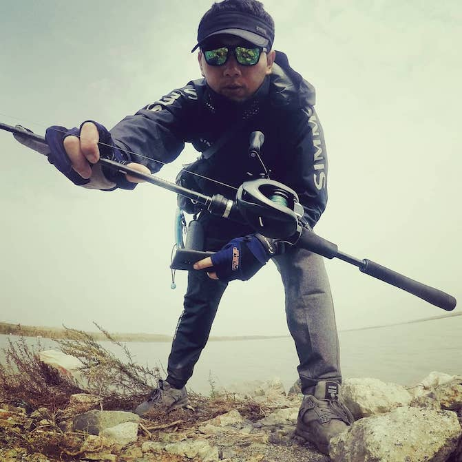

---

---

**Gary** ：来自山东，现在定居于上海。

> 热爱骑行，酷爱路亚；喜欢HiFi、折腾新技术；擅长研发管理、企业管理！

[曾经折腾那些](https://cuiqingwei1981.github.io/)	｜	[物联网知识库](https://iotknowledges.github.io/)	｜	[小崔风火轮](https://www.amobbs.com/thread-946455-1-1.html?_dsign=dff6a761)	|	[串口调试工具](https://www.amobbs.com/thread-703431-1-1.html)	|	[Socket调试工具](https://www.amobbs.com/thread-4168322-1-1.html)	|	[CC-Debugger仿真器开源](https://www.amobbs.com/thread-5665420-1-1.html)	| [闪动的“LOVE”](https://www.amobbs.com/thread-684972-1-1.html)	｜	[公司创始人](http://www.educationtek.com/)

---
##### 活着，就要去折腾!

> “当你意识到生命有多宝贵的时候，你就会特别惜命，但惜命最好的方法不是养生，而是折腾自己，把自己的生命淋漓尽致地燃烧透了……”
> 人越长大越惜命，开始在平平淡淡才是真的“信仰”中接受安静，更将生命“保护”起来，不再折腾，他们的生活开始像巴黎般“诗意”。
> 但诗意的生活更适合垂暮之年，年轻应像纽约般写实，应该去折腾，在有限的时光里活得精彩、丰满。不辜负只有一次的生命。

##### 不出去折腾，有负生命给你的上场机会

> 斑驳如画的风景是大自然对人类的慷慨，出去走走是生命对人生的期待。你的世界，有多少风景停留在光影和别人的描述中？再不折腾就老了，有些风景或许真的不能亲眼去感受了。

##### 工作上折腾，是对梦想的尊重

> 世界上，成功的有两种人，一种人是傻子，一种人是疯子。
> 傻子在工作中的最高境界是安分守职，他们害怕挑战，对压力恐惧；“疯子”则在工作中力求折腾，燃烧自己的热情去挑战，体验工作所蕴含的温度与厚度，在折腾中进步，在进步中实现梦想。

##### 生活里不折腾，拿什么回忆

> 年轻的生活点滴构成一本青春纪念册，是折腾不动时候的回忆。趁年轻，趁当下，工作之余不要再一个人安静在自己的世界，多陪陪家人，多看看朋友，偶尔喝点小酒、夜里狂欢都没关系，珍惜能在一起的时间，多去制造回忆。

 

个人微信公众号

扫码或搜索：骑行点滴
